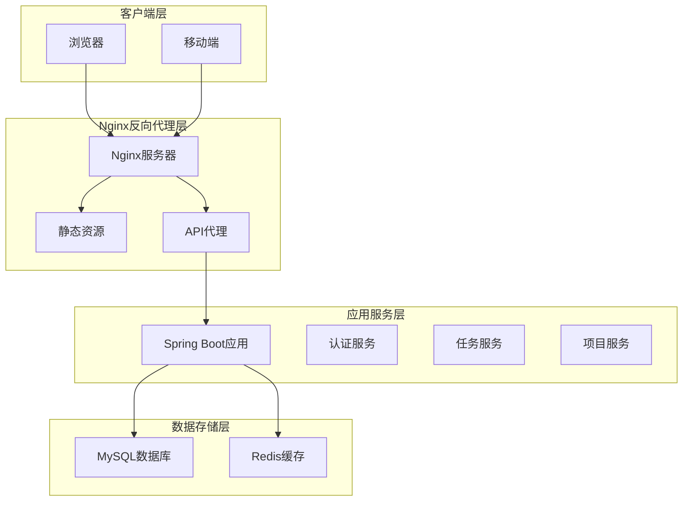
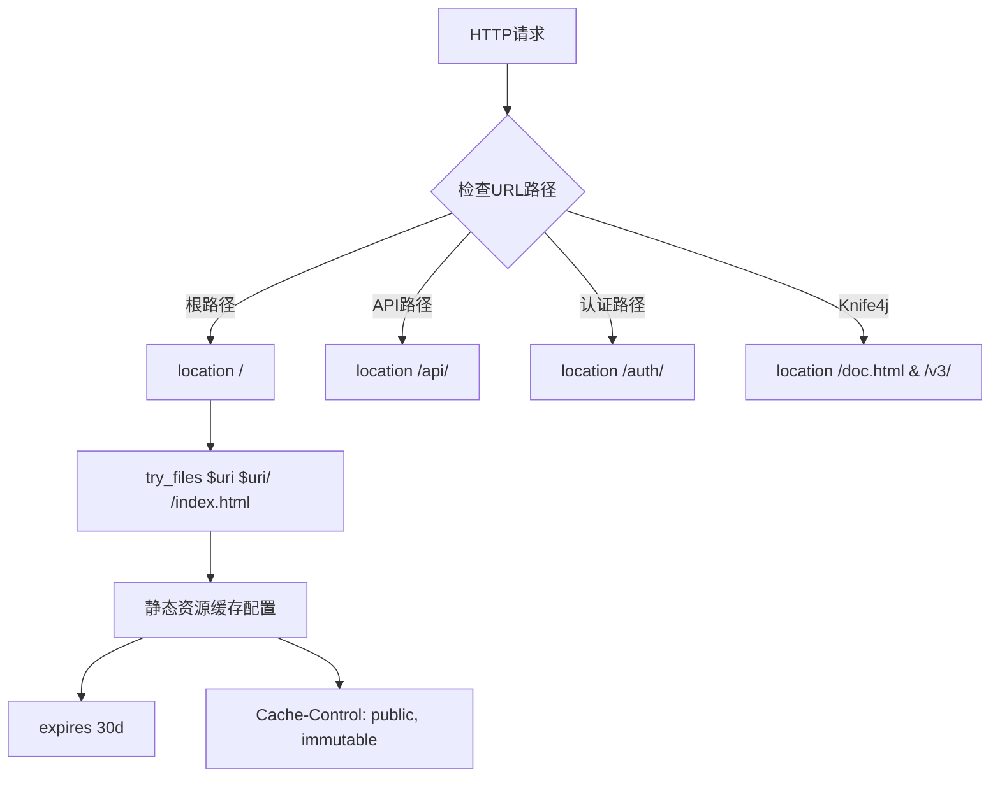
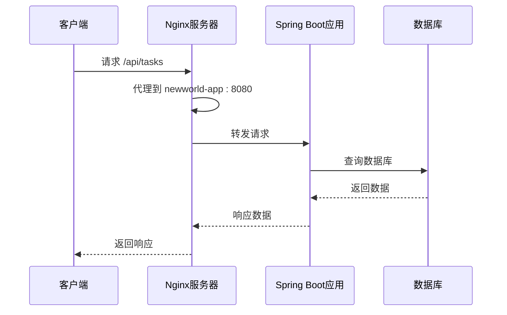
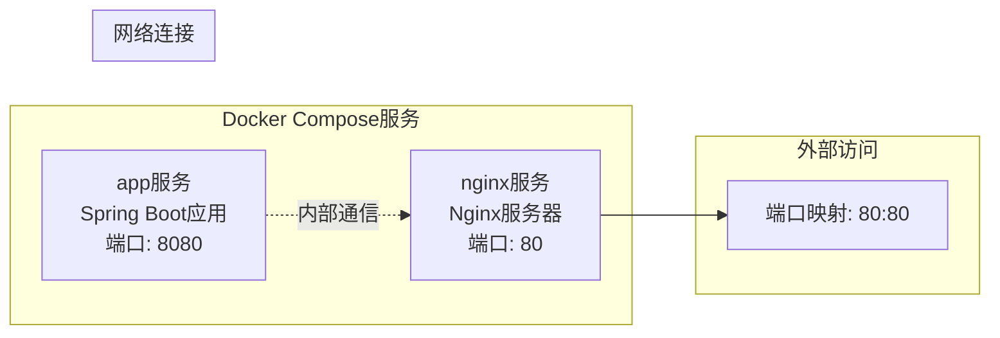
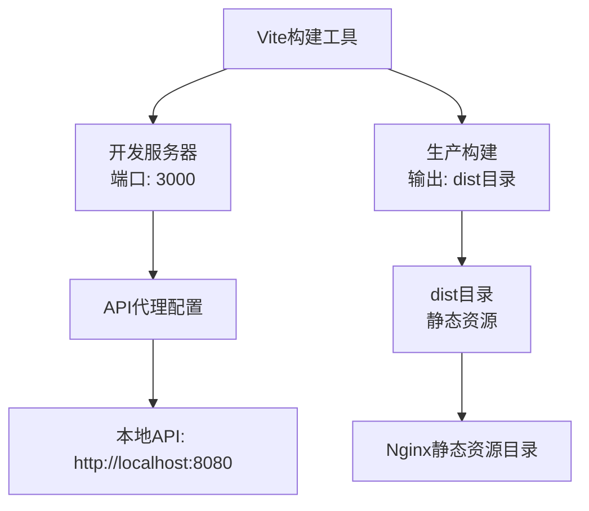
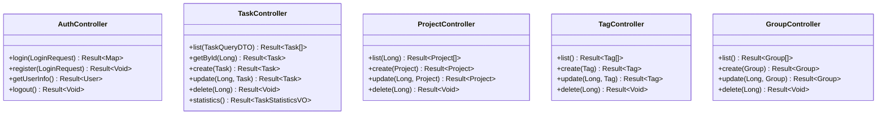
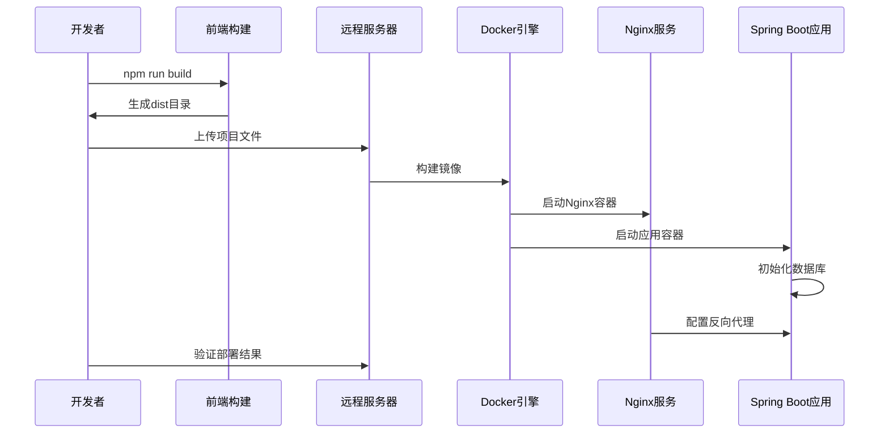
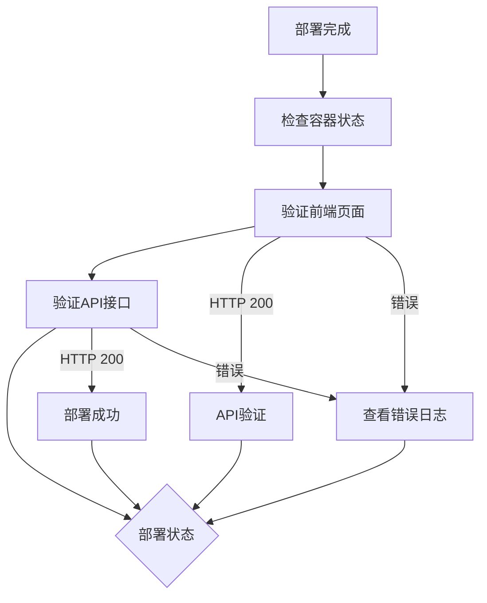

# Nginx部署指南

<cite>
**本文档引用的文件**
- [nginx.conf](file://nginx/nginx.conf)
- [Dockerfile](file://nginx/Dockerfile)
- [docker-compose.yml](file://docker-compose.yml)
- [application.yml](file://backend/src/main/resources/application.yml)
- [application-prod.yml](file://backend/src/main/resources/application-prod.yml)
- [backend Dockerfile](file://backend/Dockerfile)
- [vite.config.js](file://frontend/vite.config.js)
- [package.json](file://frontend/package.json)
- [deploy.js](file://deploy/deploy.js)
- [start.sh](file://deploy/start.sh)
- [AuthController.java](file://backend/src/main/java/com/newworld/controller/AuthController.java)
- [TaskController.java](file://backend/src/main/java/com/newworld/controller/TaskController.java)
- [ProjectController.java](file://backend/src/main/java/com/newworld/controller/ProjectController.java)
</cite>

## 目录
1. [简介](#简介)
2. [项目架构概览](#项目架构概览)
3. [Nginx配置详解](#nginx配置详解)
4. [Docker部署方案](#docker部署方案)
5. [前后端分离架构](#前后端分离架构)
6. [API路由映射](#api路由映射)
7. [部署流程图](#部署流程图)
8. [性能优化建议](#性能优化建议)
9. [故障排除指南](#故障排除指南)
10. [总结](#总结)

## 简介

NewWorld是一个基于Vue 3 + Spring Boot的个人工作计划管理系统。本指南专注于Nginx部署配置，涵盖从开发环境到生产环境的完整部署流程。

该系统采用前后端分离架构，使用Nginx作为反向代理服务器，负责静态资源托管、API请求转发和负载均衡。

## 项目架构概览



**图表来源**
- [nginx.conf:1-63](file://nginx/nginx.conf#L1-L63)
- [docker-compose.yml:1-29](file://docker-compose.yml#L1-L29)

## Nginx配置详解

### 核心配置文件分析

Nginx配置文件位于`nginx/nginx.conf`，包含以下关键配置：

#### 基础服务器配置
- **监听端口**: 80端口
- **服务器名称**: localhost
- **gzip压缩**: 开启多种内容类型的压缩支持

#### 静态资源处理


**图表来源**
- [nginx.conf:11-22](file://nginx/nginx.conf#L11-L22)

#### API反向代理配置



**图表来源**
- [nginx.conf:24-33](file://nginx/nginx.conf#L24-L33)
- [docker-compose.yml:4-16](file://docker-compose.yml#L4-L16)

**章节来源**
- [nginx.conf:1-63](file://nginx/nginx.conf#L1-L63)

### 静态资源优化配置

Nginx配置了针对不同文件类型的缓存策略：

| 文件类型 | 缓存策略 | 过期时间 |
|---------|---------|---------|
| JavaScript | immutable | 30天 |
| CSS | immutable | 30天 |
| 图片 | immutable | 30天 |
| 字体文件 | immutable | 30天 |

**章节来源**
- [nginx.conf:17-21](file://nginx/nginx.conf#L17-L21)

## Docker部署方案

### Docker Compose编排



**图表来源**
- [docker-compose.yml:18-29](file://docker-compose.yml#L18-L29)

### 服务配置详情

#### 应用服务(app)
- **镜像构建**: 基于Maven和OpenJDK 8
- **端口暴露**: 8080端口(仅内部使用)
- **环境变量**: 激活prod配置文件
- **网络配置**: 使用host.docker.internal进行主机访问

#### Nginx服务(nginx)
- **镜像构建**: 基于nginx:alpine
- **端口映射**: 80:80
- **依赖关系**: 依赖app服务启动
- **静态资源**: 从frontend/dist目录加载

**章节来源**
- [docker-compose.yml:1-29](file://docker-compose.yml#L1-L29)
- [backend Dockerfile:1-14](file://backend/Dockerfile#L1-L14)
- [nginx/Dockerfile:1-5](file://nginx/Dockerfile#L1-L5)

### 启动脚本

提供两种启动方式：

1. **本地开发启动**: `./deploy/start.sh`
   - 自动构建并启动所有容器
   - 访问地址: http://localhost
   - API文档: http://localhost/doc.html

2. **一键部署脚本**: `node deploy/deploy.js`
   - 支持完整部署、快速部署、仅构建等模式
   - 自动执行前端构建、文件上传、镜像构建、容器部署

**章节来源**
- [start.sh:1-25](file://deploy/start.sh#L1-L25)
- [deploy.js:1-243](file://deploy/deploy.js#L1-L243)

## 前后端分离架构

### 前端构建配置



**图表来源**
- [vite.config.js:12-25](file://frontend/vite.config.js#L12-L25)

### 前端依赖分析

主要技术栈包括：
- **框架**: Vue 3.3.4 + Vue Router 4.2.4 + Pinia 2.1.4
- **UI组件**: Element Plus 2.4.0
- **日历组件**: FullCalendar 6.1.8
- **HTTP客户端**: Axios 1.5.0
- **构建工具**: Vite 2.9.16

**章节来源**
- [package.json:1-30](file://frontend/package.json#L1-L30)
- [vite.config.js:1-26](file://frontend/vite.config.js#L1-L26)

## API路由映射

### 后端控制器结构

系统采用RESTful API设计，主要控制器如下：



**图表来源**
- [AuthController.java:17-55](file://backend/src/main/java/com/newworld/controller/AuthController.java#L17-L55)
- [TaskController.java:17-112](file://backend/src/main/java/com/newworld/controller/TaskController.java#L17-L112)
- [ProjectController.java:14-51](file://backend/src/main/java/com/newworld/controller/ProjectController.java#L14-L51)

### API路由规则

| 控制器 | 基础路径 | 主要接口 |
|-------|---------|---------|
| AuthController | `/api/auth` | 登录、注册、用户信息、登出 |
| TaskController | `/api/tasks` | 任务CRUD、状态更新、优先级设置、统计 |
| ProjectController | `/api/projects` | 项目CRUD、按分组查询 |
| TagController | `/api/tags` | 标签CRUD |
| GroupController | `/api/groups` | 分组CRUD |

**章节来源**
- [AuthController.java:19-55](file://backend/src/main/java/com/newworld/controller/AuthController.java#L19-L55)
- [TaskController.java:19-112](file://backend/src/main/java/com/newworld/controller/TaskController.java#L19-L112)
- [ProjectController.java:16-51](file://backend/src/main/java/com/newworld/controller/ProjectController.java#L16-L51)

## 部署流程图

### 完整部署流程



**图表来源**
- [deploy.js:30-146](file://deploy/deploy.js#L30-L146)

### 部署验证流程



**图表来源**
- [deploy.js:117-146](file://deploy/deploy.js#L117-L146)

**章节来源**
- [deploy.js:168-243](file://deploy/deploy.js#L168-L243)

## 性能优化建议

### Nginx性能调优

1. **静态资源缓存**
   - 已配置30天缓存策略
   - 使用immutable标志确保长期缓存
   - 支持gzip压缩减少传输体积

2. **代理超时配置**
   - proxy_read_timeout: 60秒
   - proxy_connect_timeout: 10秒
   - 适用于长连接和大数据传输场景

3. **头部信息传递**
   - 保留原始客户端IP信息
   - 传递协议信息(X-Forwarded-Proto)
   - 支持HTTPS代理场景

### Docker优化建议

1. **镜像大小优化**
   - 使用alpine基础镜像
   - 多阶段构建减少最终镜像大小
   - 清理构建缓存和临时文件

2. **资源限制**
   - 为容器设置内存和CPU限制
   - 配置健康检查
   - 使用重启策略保证服务可用性

## 故障排除指南

### 常见部署问题

#### 1. 端口冲突
**问题**: 端口80被占用
**解决方案**: 
- 检查系统中占用80端口的服务
- 修改Nginx配置中的监听端口
- 使用`netstat`或`lsof`命令排查

#### 2. API请求失败
**问题**: 浏览器控制台显示404或跨域错误
**解决方案**:
- 确认Nginx代理配置正确
- 检查后端服务是否正常运行
- 验证Docker网络连接

#### 3. 静态资源加载失败
**问题**: 页面样式或图片无法显示
**解决方案**:
- 检查Nginx静态资源目录权限
- 确认dist目录构建完成
- 验证文件路径映射配置

### 调试方法

1. **查看容器日志**
   ```bash
   docker logs newworld-app
   docker logs newworld-nginx
   ```

2. **检查网络连接**
   ```bash
   docker network ls
   docker inspect newworld_app_1
   ```

3. **验证服务状态**
   ```bash
   curl -I http://localhost/
   curl -I http://localhost/api/auth/login
   ```

**章节来源**
- [deploy.js:117-146](file://deploy/deploy.js#L117-L146)

## 总结

本Nginx部署指南涵盖了NewWorld项目的完整部署流程，包括：

1. **核心配置**: Nginx反向代理、静态资源缓存、API路由转发
2. **Docker编排**: 多容器服务协调、网络配置、环境变量管理
3. **前后端分离**: 前端构建、静态资源托管、API代理配置
4. **部署自动化**: 一键部署脚本、验证机制、故障排除

通过遵循本指南，可以实现NewWorld系统的稳定部署和高效运维。建议在生产环境中进一步完善监控、日志管理和安全配置。