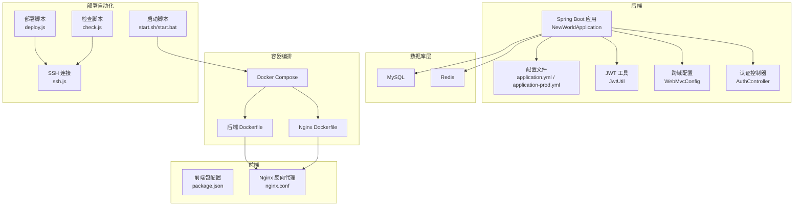
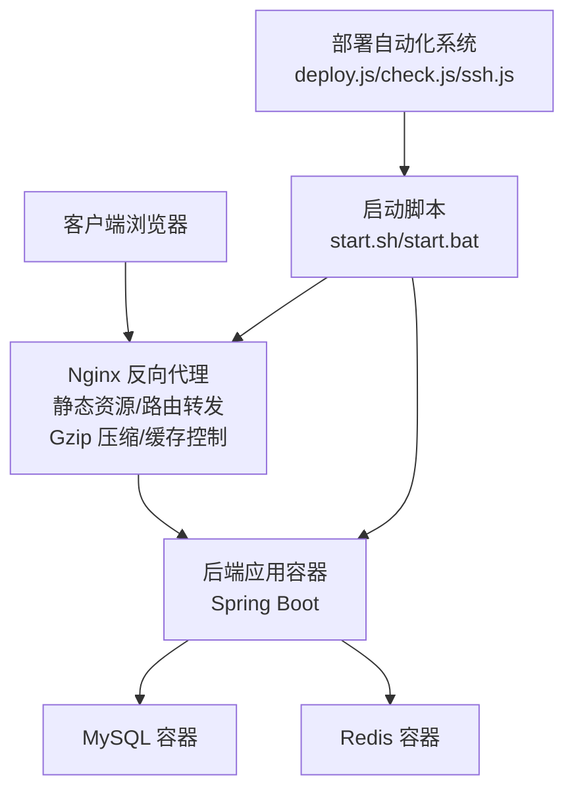
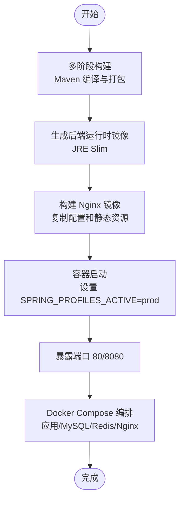
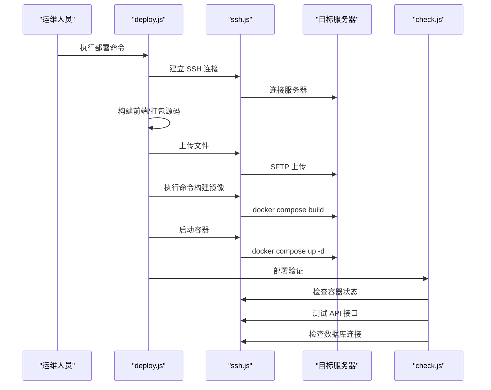
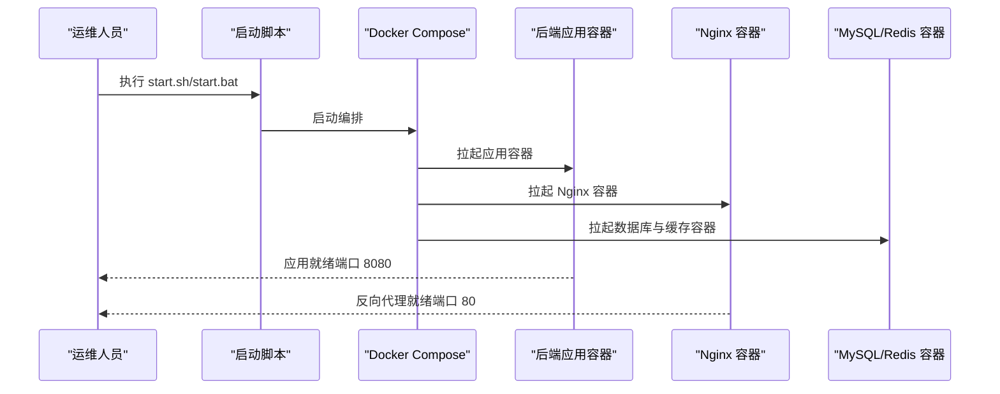
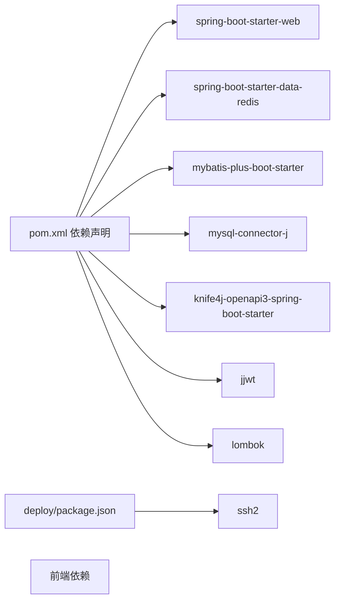

# 部署指南

<cite>
**本文引用的文件**
- [docker-compose.yml](file://docker-compose.yml)
- [Dockerfile](file://backend/Dockerfile)
- [nginx.conf](file://nginx/nginx.conf)
- [nginx/Dockerfile](file://nginx/Dockerfile)
- [deploy.js](file://deploy/deploy.js)
- [check.js](file://deploy/check.js)
- [ssh.js](file://deploy/ssh.js)
- [package.json](file://deploy/package.json)
- [start.sh](file://deploy/start.sh)
- [start.bat](file://deploy/start.bat)
- [application-prod.yml](file://backend/src/main/resources/application-prod.yml)
- [application.yml](file://backend/src/main/resources/application.yml)
- [pom.xml](file://backend/pom.xml)
- [init.sql](file://backend/sql/init.sql)
- [NewWorldApplication.java](file://backend/src/main/java/com/newworld/NewWorldApplication.java)
- [JwtUtil.java](file://backend/src/main/java/com/newworld/common/JwtUtil.java)
- [WebMvcConfig.java](file://backend/src/main/java/com/newworld/config/WebMvcConfig.java)
- [AuthController.java](file://backend/src/main/java/com/newworld/controller/AuthController.java)
- [package.json](file://frontend/package.json)
</cite>

## 更新摘要
**变更内容**
- 新增完整的部署自动化系统，包括 deploy.js、check.js、ssh.js 等自动化脚本
- 新增 nginx 反向代理配置，提供静态资源托管和 API 代理功能
- 更新跨平台部署脚本（start.sh/start.bat），增强部署流程自动化
- 完善部署流程的监控和验证机制

## 目录
1. [简介](#简介)
2. [项目结构](#项目结构)
3. [核心组件](#核心组件)
4. [架构总览](#架构总览)
5. [详细组件分析](#详细组件分析)
6. [依赖分析](#依赖分析)
7. [性能考虑](#性能考虑)
8. [故障排除指南](#故障排除指南)
9. [结论](#结论)
10. [附录](#附录)

## 简介
本指南面向生产环境部署"新世界"项目，覆盖容器化与非容器化两种部署路径，提供环境变量配置、负载均衡与高可用、监控与日志、运维最佳实践与故障排除建议。项目后端基于 Spring Boot，前端基于 Vue 3 + Vite，采用 MySQL 与 Redis 存储，使用 JWT 进行鉴权，并通过 Knife4j 提供在线接口文档。

**更新** 新增完整的部署自动化系统，支持一键部署、快速部署、镜像构建、服务重启等多种部署模式，以及完善的部署验证和监控功能。

## 项目结构
- 后端：Spring Boot 应用，包含配置文件、实体、服务、控制器、拦截器与工具类。
- 前端：Vue 3 应用，构建产物可由 Nginx 提供静态托管。
- 部署：Docker Compose 编排应用、MySQL 与 Redis；提供一键启动脚本和完整的部署自动化系统。
- 数据库初始化：提供 SQL 初始化脚本，包含用户、项目、任务、标签等核心表及索引。
- Nginx 反向代理：提供静态资源托管、API 代理、Gzip 压缩等功能。

**图表来源**
- [docker-compose.yml:1-29](file://docker-compose.yml#L1-L29)
- [Dockerfile:1-14](file://backend/Dockerfile#L1-L14)
- [nginx/Dockerfile:1-5](file://nginx/Dockerfile#L1-L5)
- [nginx.conf:1-63](file://nginx/nginx.conf#L1-L63)
- [deploy.js:1-243](file://deploy/deploy.js#L1-L243)
- [check.js:1-152](file://deploy/check.js#L1-L152)
- [ssh.js:1-61](file://deploy/ssh.js#L1-L61)
- [start.sh:1-25](file://deploy/start.sh#L1-L25)
- [start.bat:1-17](file://deploy/start.bat#L1-L17)

**章节来源**
- [docker-compose.yml:1-29](file://docker-compose.yml#L1-L29)
- [Dockerfile:1-14](file://backend/Dockerfile#L1-L14)
- [nginx/Dockerfile:1-5](file://nginx/Dockerfile#L1-L5)
- [nginx.conf:1-63](file://nginx/nginx.conf#L1-L63)
- [deploy.js:1-243](file://deploy/deploy.js#L1-L243)
- [check.js:1-152](file://deploy/check.js#L1-L152)
- [ssh.js:1-61](file://deploy/ssh.js#L1-L61)
- [start.sh:1-25](file://deploy/start.sh#L1-L25)
- [start.bat:1-17](file://deploy/start.bat#L1-L17)

## 核心组件
- 应用入口：Spring Boot 启动类负责加载配置与启动 Web 容器。
- 配置体系：开发与生产环境分离，生产配置通过环境变量注入敏感参数。
- 鉴权与跨域：JWT 工具与拦截器配合，统一处理登录态；WebMvcConfig 提供全局跨域策略。
- 接口文档：Knife4j 在线文档，便于联调与测试。
- 数据与缓存：MyBatis-Plus 访问 MySQL，Redis 用于会话或缓存场景。
- 构建与打包：Maven 多模块构建，最终产出可执行 JAR。
- **新增** Nginx 反向代理：提供静态资源托管、API 代理、Gzip 压缩、缓存控制等功能。
- **新增** 部署自动化系统：支持多种部署模式，提供完整的部署验证和监控功能。

**章节来源**
- [NewWorldApplication.java:1-13](file://backend/src/main/java/com/newworld/NewWorldApplication.java#L1-L13)
- [application.yml:1-75](file://backend/src/main/resources/application.yml#L1-L75)
- [application-prod.yml:1-24](file://backend/src/main/resources/application-prod.yml#L1-L24)
- [JwtUtil.java:1-78](file://backend/src/main/java/com/newworld/common/JwtUtil.java#L1-L78)
- [WebMvcConfig.java:1-53](file://backend/src/main/java/com/newworld/config/WebMvcConfig.java#L1-L53)
- [pom.xml:1-117](file://backend/pom.xml#L1-L117)
- [nginx.conf:1-63](file://nginx/nginx.conf#L1-L63)
- [deploy.js:1-243](file://deploy/deploy.js#L1-L243)

## 架构总览
下图展示生产部署的典型拓扑：Nginx 作为反向代理与静态资源服务，后端应用通过容器运行，数据持久化至 MySQL，缓存使用 Redis。容器编排通过 Docker Compose 实现一键启动。新增的部署自动化系统提供了完整的部署、验证、监控能力。

**图表来源**
- [docker-compose.yml:1-29](file://docker-compose.yml#L1-L29)
- [nginx.conf:1-63](file://nginx/nginx.conf#L1-L63)
- [deploy.js:1-243](file://deploy/deploy.js#L1-L243)
- [check.js:1-152](file://deploy/check.js#L1-L152)
- [ssh.js:1-61](file://deploy/ssh.js#L1-L61)
- [start.sh:1-25](file://deploy/start.sh#L1-L25)
- [start.bat:1-17](file://deploy/start.bat#L1-L17)

## 详细组件分析

### Docker 容器化部署
- 构建阶段：使用 Maven 多阶段构建，先在构建镜像中下载依赖与编译打包，再复制到精简运行时镜像。
- 运行阶段：以 JRE 运行时镜像为基础，暴露应用端口，设置 Spring Profile 为 prod。
- 编排：Docker Compose 将应用、MySQL、Redis 统一编排，映射端口并设置重启策略。
- **新增** Nginx 镜像：基于 Alpine Linux，复制配置文件和前端构建产物，提供静态资源托管。

**图表来源**
- [Dockerfile:1-14](file://backend/Dockerfile#L1-L14)
- [nginx/Dockerfile:1-5](file://nginx/Dockerfile#L1-L5)
- [docker-compose.yml:1-29](file://docker-compose.yml#L1-L29)

**章节来源**
- [Dockerfile:1-14](file://backend/Dockerfile#L1-L14)
- [nginx/Dockerfile:1-5](file://nginx/Dockerfile#L1-L5)
- [docker-compose.yml:1-29](file://docker-compose.yml#L1-L29)

### Nginx 反向代理配置
- **静态资源托管**：前端构建产物位于 `/usr/share/nginx/html`，支持单页应用路由。
- **API 代理**：将 `/api/` 前缀的请求代理到后端应用容器。
- **Gzip 压缩**：启用静态资源压缩，提升传输效率。
- **缓存控制**：为静态资源设置长期缓存策略。
- **接口文档代理**：支持 Knife4j 在线文档的访问。

**章节来源**
- [nginx.conf:1-63](file://nginx/nginx.conf#L1-L63)

### 部署自动化系统
- **deploy.js**：完整的部署脚本，支持多种部署模式
  - 完整部署：前端构建→上传→构建镜像→启动→验证
  - 快速部署：仅上传→构建镜像→启动（跳过前端构建）
  - 仅远程构建：跳过源码上传
  - 仅重启：重新启动现有容器
  - 仅执行 SQL：执行数据库初始化脚本
- **check.js**：服务检查工具，支持多种检查模式
  - 容器状态检查
  - 日志查看（支持指定行数）
  - API 接口测试
  - 数据库连接检查
  - 服务器环境检查
- **ssh.js**：SSH 连接和文件传输工具
  - 支持 SSH 密码认证
  - 提供命令执行和文件上传功能

**图表来源**
- [deploy.js:1-243](file://deploy/deploy.js#L1-L243)
- [check.js:1-152](file://deploy/check.js#L1-L152)
- [ssh.js:1-61](file://deploy/ssh.js#L1-L61)

**章节来源**
- [deploy.js:1-243](file://deploy/deploy.js#L1-L243)
- [check.js:1-152](file://deploy/check.js#L1-L152)
- [ssh.js:1-61](file://deploy/ssh.js#L1-L61)

### 环境变量与配置项
- 数据库连接
  - 地址与凭据：通过环境变量注入，避免硬编码。
  - 驱动与连接串：生产配置中定义驱动类名与连接参数。
- Redis 连接
  - 主机、端口、密码、数据库索引等通过环境变量注入。
- JWT 密钥与过期时间
  - 密钥与过期时间在配置文件中定义，生产环境建议通过环境变量覆盖。
- 跨域设置
  - 允许所有来源、方法、请求头，并允许携带凭证，预检请求有效期 1 小时。
- Nginx 配置
  - 反向代理、静态资源缓存、Gzip 压缩等配置。
- 日志级别
  - 生产环境建议调整为 info 或 warn，减少冗余输出。

**章节来源**
- [application-prod.yml:1-24](file://backend/src/main/resources/application-prod.yml#L1-L24)
- [application.yml:1-75](file://backend/src/main/resources/application.yml#L1-L75)
- [WebMvcConfig.java:1-53](file://backend/src/main/java/com/newworld/config/WebMvcConfig.java#L1-L53)
- [JwtUtil.java:1-78](file://backend/src/main/java/com/newworld/common/JwtUtil.java#L1-L78)
- [nginx.conf:1-63](file://nginx/nginx.conf#L1-L63)

### 部署方式与步骤

#### 方式一：Docker Compose 一键部署
- 适用场景：本地开发验证、小规模生产或快速试用。
- 步骤概要：
  - 准备环境变量（数据库密码、Redis 密码等）。
  - 执行一键启动脚本，自动拉起应用、MySQL、Redis。
  - 访问应用与接口文档进行验证。

**图表来源**
- [start.sh:1-25](file://deploy/start.sh#L1-L25)
- [start.bat:1-17](file://deploy/start.bat#L1-L17)
- [docker-compose.yml:1-29](file://docker-compose.yml#L1-L29)

**章节来源**
- [start.sh:1-25](file://deploy/start.sh#L1-L25)
- [start.bat:1-17](file://deploy/start.bat#L1-L17)
- [docker-compose.yml:1-29](file://docker-compose.yml#L1-L29)

#### 方式二：部署自动化系统部署
- 适用场景：需要自动化部署、远程部署、批量部署的生产环境。
- 步骤概要：
  - 配置 ssh.js 中的目标服务器信息。
  - 执行 `node deploy/deploy.js` 进行完整部署。
  - 使用 `node deploy/check.js` 进行服务检查。
  - 支持多种部署模式：完整部署、快速部署、仅构建、仅重启等。

**更新** 新增部署自动化系统，提供完整的部署生命周期管理。

**章节来源**
- [deploy.js:1-243](file://deploy/deploy.js#L1-L243)
- [check.js:1-152](file://deploy/check.js#L1-L152)
- [ssh.js:1-61](file://deploy/ssh.js#L1-L61)

#### 方式三：传统服务器部署（非容器）
- 适用场景：对容器有约束或需要更细粒度控制的环境。
- 步骤概要：
  - 在目标服务器安装 JDK 8+、MySQL 与 Redis。
  - 部署前准备 application-prod.yml，确保数据库与 Redis 地址、凭据正确。
  - 使用 Maven 打包生成可执行 JAR，按需配置 systemd 或进程守护。
  - 启动应用并验证接口与数据库连通性。

**章节来源**
- [pom.xml:1-117](file://backend/pom.xml#L1-L117)
- [application-prod.yml:1-24](file://backend/src/main/resources/application-prod.yml#L1-L24)

#### 方式四：云平台部署（示例：Kubernetes）
- 适用场景：需要弹性扩缩容与高可用的生产环境。
- 建议步骤：
  - 将应用打包为容器镜像并推送到镜像仓库。
  - 编写 Deployment、Service、ConfigMap、Secret 等清单。
  - 通过 Ingress 对外暴露服务，配置 TLS 证书。
  - 使用 Helm Charts 封装配置，便于版本化管理。

（本节为概念性指导，不直接对应具体文件）

### 负载均衡与高可用
- Nginx 反向代理
  - 作为统一入口，转发静态资源与 API 请求。
  - 支持健康检查与熔断策略，结合后端多实例实现高可用。
  - 提供 Gzip 压缩和静态资源缓存，提升性能。
- SSL/TLS 证书
  - 通过 Let's Encrypt 或商业证书颁发机构获取证书，配置 HTTPS。
- 健康检查
  - 对后端提供健康端点（如 /actuator/health），Nginx/负载均衡定期探测。
- 会话与缓存
  - Redis 作为共享缓存，支持横向扩展。

**更新** Nginx 提供了完整的反向代理、静态资源托管和性能优化功能。

（本节为概念性指导，不直接对应具体文件）

### 监控与日志
- 应用日志
  - 生产环境建议将日志输出到标准输出或文件，并结合集中式日志系统（如 ELK/Fluentd）采集。
- 性能监控
  - 结合 APM 工具（如 SkyWalking/Zipkin）追踪链路与指标。
- 错误追踪
  - 对关键异常进行告警，结合日志聚合定位问题根因。
- **新增** 部署监控
  - 使用 `node deploy/check.js` 进行服务状态检查。
  - 自动化部署过程中的部署验证和错误报告。

**更新** 新增部署自动化系统的监控和验证功能。

（本节为概念性指导，不直接对应具体文件）

## 依赖分析
- 后端依赖
  - Spring Web、Redis、MyBatis-Plus、MySQL Connector、Knife4j、JWT、Lombok 等。
- 前端依赖
  - Vue 3、Element Plus、Axios、Pinia、Vue Router 等。
- 构建与打包
  - Maven 插件负责打包与重命名最终产物。
- **新增** 部署依赖
  - Node.js 依赖 ssh2 进行 SSH 连接和文件传输。
  - Docker 和 Docker Compose 用于容器编排。

**图表来源**
- [pom.xml:1-117](file://backend/pom.xml#L1-L117)
- [deploy/package.json:1-9](file://deploy/package.json#L1-L9)

**章节来源**
- [pom.xml:1-117](file://backend/pom.xml#L1-L117)
- [package.json:1-30](file://frontend/package.json#L1-L30)
- [deploy/package.json:1-9](file://deploy/package.json#L1-L9)

## 性能考虑
- 数据库优化
  - 初始化脚本已建立常用索引，建议结合慢查询日志与 EXPLAIN 分析热点 SQL。
- 缓存策略
  - 利用 Redis 缓存热点数据，合理设置过期时间与淘汰策略。
- 应用层面
  - 控制并发与连接池大小，避免阻塞；开启必要的压缩与限流。
- 静态资源
  - 前端构建产物交由 Nginx 提供，启用 Gzip/Brotli 压缩与缓存头。
- **新增** Nginx 性能优化
  - Gzip 压缩配置，支持多种静态资源类型。
  - 长期缓存策略，减少带宽消耗。
  - 反向代理优化，提升 API 响应速度。

**更新** 新增 Nginx 的性能优化配置。

（本节为通用指导，不直接对应具体文件）

## 故障排除指南
- 启动失败
  - 检查数据库与 Redis 的可达性与凭据是否正确。
  - 查看容器日志与应用启动日志，确认端口占用与权限问题。
- 登录鉴权异常
  - 核对 JWT 密钥与过期时间配置，确保前后端一致。
  - 检查跨域配置是否允许前端域名与凭证。
- 接口文档不可用
  - 确认 Knife4j 开关与路径配置，检查静态资源映射。
- 数据库初始化
  - 使用初始化脚本创建数据库与表结构，导入默认用户以便验证。
- **新增** 部署问题
  - 使用 `node deploy/check.js` 进行全面的服务检查。
  - 检查 SSH 连接配置和网络连通性。
  - 验证 Docker 镜像构建和容器启动状态。
- **新增** Nginx 问题
  - 检查 Nginx 配置文件语法和权限。
  - 验证静态资源文件是否存在。
  - 检查反向代理配置是否正确。

**更新** 新增部署自动化系统的故障排除指南。

**章节来源**
- [application-prod.yml:1-24](file://backend/src/main/resources/application-prod.yml#L1-L24)
- [application.yml:1-75](file://backend/src/main/resources/application.yml#L1-L75)
- [WebMvcConfig.java:1-53](file://backend/src/main/java/com/newworld/config/WebMvcConfig.java#L1-L53)
- [JwtUtil.java:1-78](file://backend/src/main/java/com/newworld/common/JwtUtil.java#L1-L78)
- [init.sql:1-95](file://backend/sql/init.sql#L1-L95)
- [check.js:1-152](file://deploy/check.js#L1-L152)
- [ssh.js:1-61](file://deploy/ssh.js#L1-L61)
- [nginx.conf:1-63](file://nginx/nginx.conf#L1-L63)

## 结论
通过 Docker Compose 可快速完成"新世界"项目的生产部署，配合 Nginx 反向代理与 SSL 证书，可满足中小规模生产的可用性与安全性需求。新增的部署自动化系统进一步提升了部署效率和可靠性，支持多种部署模式和完善的监控验证功能。建议在生产环境中完善监控与日志体系、实施严格的变更与回滚流程，并根据业务增长逐步演进到 Kubernetes 等更高阶的编排平台。

**更新** 新增的部署自动化系统显著提升了部署的自动化程度和运维效率。

## 附录

### 关键配置项速查
- 数据库
  - 地址与凭据：通过环境变量注入
  - 连接参数：驱动类名、时区、字符集等
- Redis
  - 主机、端口、密码、数据库索引
- JWT
  - 密钥与过期时间
- 跨域
  - 允许来源、方法、头与凭证
- Nginx
  - 反向代理配置、静态资源缓存、Gzip 压缩
- 日志
  - 包路径与级别（生产建议 info/warn）

**章节来源**
- [application-prod.yml:1-24](file://backend/src/main/resources/application-prod.yml#L1-L24)
- [application.yml:1-75](file://backend/src/main/resources/application.yml#L1-L75)
- [WebMvcConfig.java:1-53](file://backend/src/main/java/com/newworld/config/WebMvcConfig.java#L1-L53)
- [JwtUtil.java:1-78](file://backend/src/main/java/com/newworld/common/JwtUtil.java#L1-L78)
- [nginx.conf:1-63](file://nginx/nginx.conf#L1-L63)

### 部署自动化系统使用指南
- **完整部署**：`node deploy/deploy.js`
- **快速部署**：`node deploy/deploy.js quick`
- **仅构建镜像**：`node deploy/deploy.js build`
- **仅重启**：`node deploy/deploy.js restart`
- **执行 SQL**：`node deploy/deploy.js sql`
- **服务检查**：`node deploy/check.js`
- **容器状态**：`node deploy/check.js containers`
- **查看日志**：`node deploy/check.js logs [行数]`
- **API 测试**：`node deploy/check.js api`
- **数据库检查**：`node deploy/check.js db`
- **服务器检查**：`node deploy/check.js server`

**新增** 部署自动化系统的详细使用指南。

**章节来源**
- [deploy.js:1-243](file://deploy/deploy.js#L1-L243)
- [check.js:1-152](file://deploy/check.js#L1-L152)