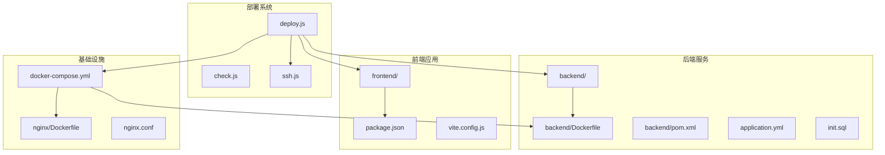
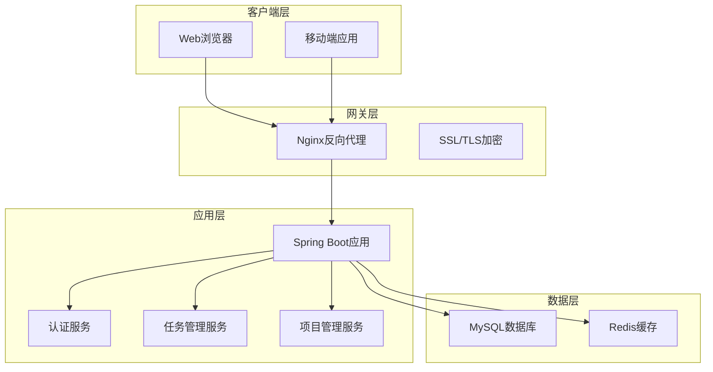
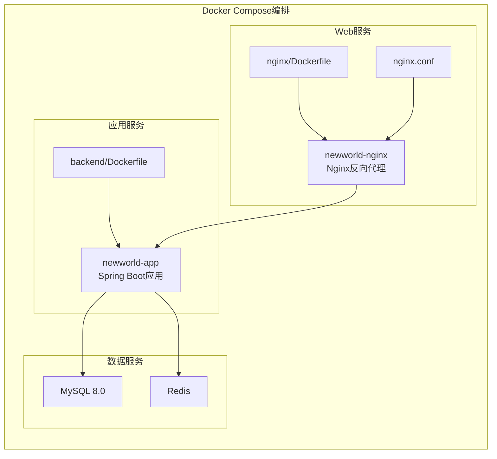
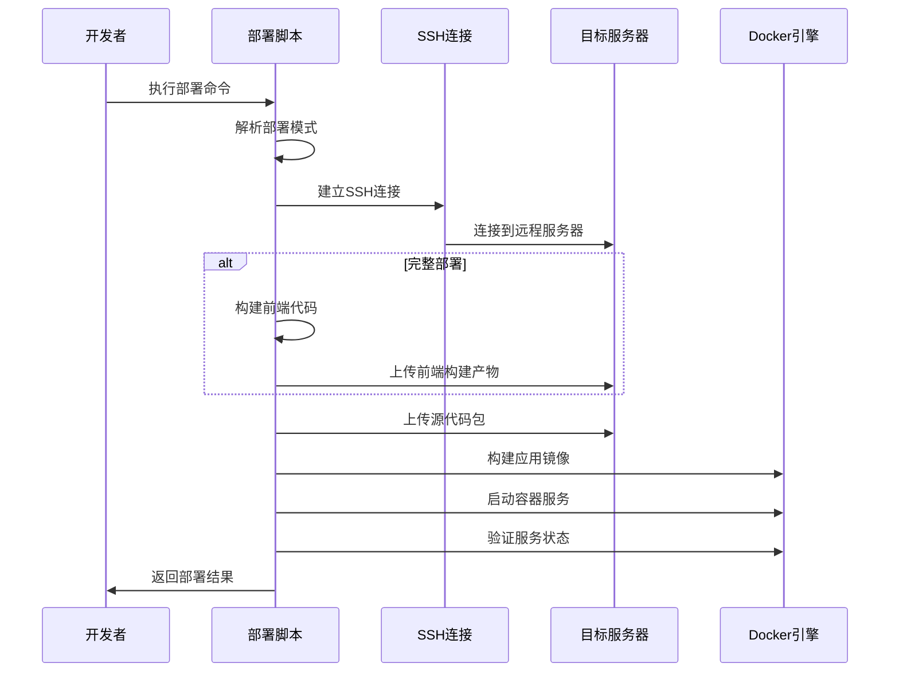
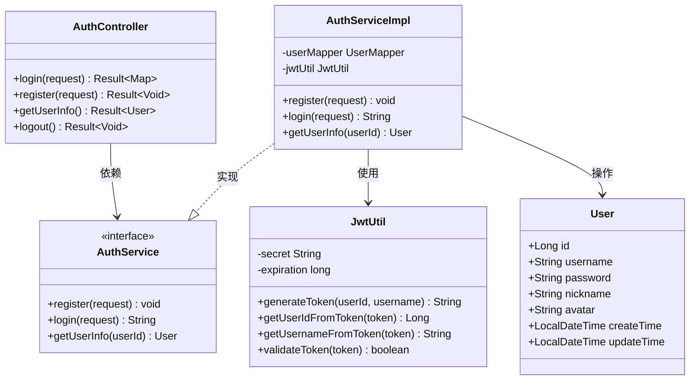
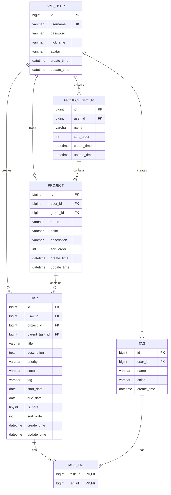
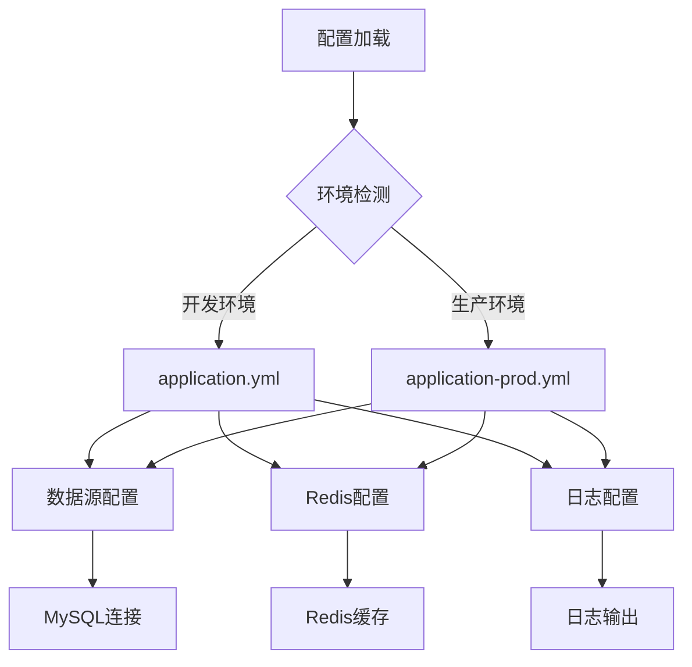
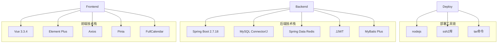
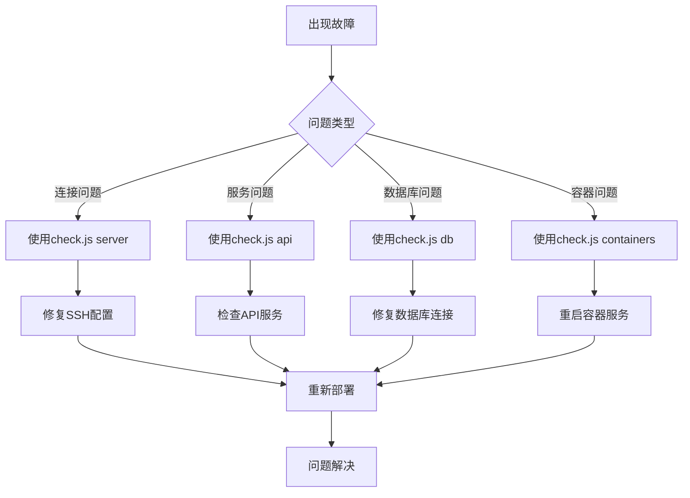

# 部署自动化系统

<cite>
**本文档引用的文件**
- [deploy.js](file://deploy/deploy.js)
- [check.js](file://deploy/check.js)
- [ssh.js](file://deploy/ssh.js)
- [docker-compose.yml](file://docker-compose.yml)
- [backend/Dockerfile](file://backend/Dockerfile)
- [nginx/Dockerfile](file://nginx/Dockerfile)
- [backend/pom.xml](file://backend/pom.xml)
- [backend/sql/init.sql](file://backend/sql/init.sql)
- [backend/src/main/resources/application.yml](file://backend/src/main/resources/application.yml)
- [backend/src/main/resources/application-prod.yml](file://backend/src/main/resources/application-prod.yml)
- [backend/src/main/java/com/newworld/NewWorldApplication.java](file://backend/src/main/java/com/newworld/NewWorldApplication.java)
- [backend/src/main/java/com/newworld/controller/AuthController.java](file://backend/src/main/java/com/newworld/controller/AuthController.java)
- [backend/src/main/java/com/newworld/service/impl/AuthServiceImpl.java](file://backend/src/main/java/com/newworld/service/impl/AuthServiceImpl.java)
- [backend/src/main/java/com/newworld/common/JwtUtil.java](file://backend/src/main/java/com/newworld/common/JwtUtil.java)
</cite>

## 目录
1. [简介](#简介)
2. [项目结构](#项目结构)
3. [核心组件](#核心组件)
4. [架构概览](#架构概览)
5. [详细组件分析](#详细组件分析)
6. [依赖关系分析](#依赖关系分析)
7. [性能考虑](#性能考虑)
8. [故障排除指南](#故障排除指南)
9. [结论](#结论)

## 简介

NewWorld 是一个基于 Vue 3 + Spring Boot 的个人工作计划管理工具，采用前后端分离架构。该部署自动化系统提供了完整的部署、验证和监控功能，支持多种部署模式以满足不同场景需求。

系统采用 Docker 容器化部署，通过 Nginx 作为反向代理，后端使用 Spring Boot 提供 RESTful API，数据库采用 MySQL，缓存使用 Redis。部署自动化脚本实现了从代码构建到服务上线的全流程自动化。

## 项目结构

项目采用模块化组织结构，主要包含以下核心模块：

**图表来源**
- [deploy.js:1-243](file://deploy/deploy.js#L1-L243)
- [docker-compose.yml:1-29](file://docker-compose.yml#L1-L29)
- [backend/Dockerfile:1-14](file://backend/Dockerfile#L1-L14)

**章节来源**
- [deploy.js:1-243](file://deploy/deploy.js#L1-L243)
- [docker-compose.yml:1-29](file://docker-compose.yml#L1-L29)

## 核心组件

### 部署控制器 (deploy.js)

部署控制器是整个自动化系统的核心，提供了五种不同的部署模式：

1. **完整部署模式**：执行完整的部署流程，包括前端构建、代码上传、镜像构建、容器部署和验证
2. **快速部署模式**：跳过前端构建步骤，直接进行代码上传和镜像构建
3. **远程构建模式**：仅在目标服务器上构建镜像，不上传源代码
4. **重启模式**：仅重启现有的容器实例
5. **SQL执行模式**：仅执行数据库初始化脚本

每个部署步骤都包含详细的日志输出和错误处理机制，确保部署过程的可追踪性和可靠性。

### 服务检查工具 (check.js)

服务检查工具提供了全面的系统健康检查功能：

- **容器状态检查**：显示所有运行中的容器及其状态
- **日志监控**：查看后端应用的实时日志输出
- **API接口测试**：验证核心API接口的可用性
- **数据库连接检查**：测试MySQL和Redis的连接状态
- **服务器环境检查**：评估服务器的系统信息和资源使用情况

### SSH连接管理 (ssh.js)

SSH连接管理模块封装了所有远程操作功能：

- **配置管理**：集中管理SSH连接参数（主机、端口、认证信息）
- **命令执行**：提供异步的SSH命令执行功能
- **文件传输**：实现安全的SFTP文件上传功能
- **连接池管理**：确保连接的可靠性和安全性

**章节来源**
- [deploy.js:169-243](file://deploy/deploy.js#L169-L243)
- [check.js:109-152](file://check.js#L109-L152)
- [ssh.js:1-61](file://ssh.js#L1-L61)

## 架构概览

系统采用微服务架构，通过Docker容器实现服务隔离和弹性伸缩：

**图表来源**
- [docker-compose.yml:3-29](file://docker-compose.yml#L3-L29)
- [backend/src/main/java/com/newworld/controller/AuthController.java:17-55](file://backend/src/main/java/com/newworld/controller/AuthController.java#L17-L55)

### 容器编排架构

**图表来源**
- [docker-compose.yml:4-29](file://docker-compose.yml#L4-L29)
- [backend/Dockerfile:1-14](file://backend/Dockerfile#L1-L14)
- [nginx/Dockerfile:1-5](file://nginx/Dockerfile#L1-L5)

## 详细组件分析

### 部署流程组件

部署流程实现了五步法的完整部署策略：

**图表来源**
- [deploy.js:30-146](file://deploy/deploy.js#L30-L146)

#### 部署步骤详解

1. **前端构建阶段**：自动检测并安装依赖，执行生产环境构建
2. **代码上传阶段**：创建压缩包，通过SFTP安全传输到服务器
3. **镜像构建阶段**：使用Docker多阶段构建优化镜像大小
4. **容器部署阶段**：通过Docker Compose管理服务生命周期
5. **服务验证阶段**：自动检查HTTP响应和数据库连接

### 认证与授权组件

系统实现了基于JWT的认证机制，确保API调用的安全性：

**图表来源**
- [backend/src/main/java/com/newworld/controller/AuthController.java:17-55](file://backend/src/main/java/com/newworld/controller/AuthController.java#L17-L55)
- [backend/src/main/java/com/newworld/service/impl/AuthServiceImpl.java:14-69](file://backend/src/main/java/com/newworld/service/impl/AuthServiceImpl.java#L14-L69)
- [backend/src/main/java/com/newworld/common/JwtUtil.java:15-78](file://backend/src/main/java/com/newworld/common/JwtUtil.java#L15-L78)

**章节来源**
- [backend/src/main/java/com/newworld/controller/AuthController.java:17-55](file://backend/src/main/java/com/newworld/controller/AuthController.java#L17-L55)
- [backend/src/main/java/com/newworld/service/impl/AuthServiceImpl.java:14-69](file://backend/src/main/java/com/newworld/service/impl/AuthServiceImpl.java#L14-L69)
- [backend/src/main/java/com/newworld/common/JwtUtil.java:15-78](file://backend/src/main/java/com/newworld/common/JwtUtil.java#L15-L78)

### 数据模型组件

系统采用关系型数据库设计，支持复杂的数据关联和查询：

**图表来源**
- [backend/sql/init.sql:8-95](file://backend/sql/init.sql#L8-L95)

**章节来源**
- [backend/sql/init.sql:1-95](file://backend/sql/init.sql#L1-L95)

### 配置管理组件

系统采用多环境配置策略，支持开发、测试和生产环境的灵活切换：

**图表来源**
- [backend/src/main/resources/application.yml:1-75](file://backend/src/main/resources/application.yml#L1-L75)
- [backend/src/main/resources/application-prod.yml:1-24](file://backend/src/main/resources/application-prod.yml#L1-L24)

**章节来源**
- [backend/src/main/resources/application.yml:1-75](file://backend/src/main/resources/application.yml#L1-L75)
- [backend/src/main/resources/application-prod.yml:1-24](file://backend/src/main/resources/application-prod.yml#L1-L24)

## 依赖关系分析

系统依赖关系清晰，各组件职责明确：

**图表来源**
- [backend/pom.xml:31-96](file://backend/pom.xml#L31-L96)
- [frontend/package.json:11-28](file://frontend/package.json#L11-L28)
- [deploy/package.json:5-7](file://deploy/package.json#L5-L7)

**章节来源**
- [backend/pom.xml:1-117](file://backend/pom.xml#L1-L117)
- [frontend/package.json:1-30](file://frontend/package.json#L1-L30)
- [deploy/package.json:1-9](file://deploy/package.json#L1-L9)

## 性能考虑

系统在设计时充分考虑了性能优化：

### 容器化优化
- **多阶段构建**：减少最终镜像大小，提高启动速度
- **资源限制**：合理配置内存和CPU使用
- **健康检查**：自动重启异常容器

### 数据库优化
- **索引设计**：为常用查询字段建立索引
- **连接池**：配置合适的数据库连接池参数
- **查询优化**：使用MyBatis Plus的高效查询机制

### 缓存策略
- **Redis缓存**：热点数据缓存，减少数据库压力
- **前端缓存**：静态资源缓存，提升用户体验
- **CDN加速**：通过Nginx提供静态资源服务

## 故障排除指南

### 常见部署问题

1. **SSH连接失败**
   - 检查服务器防火墙设置
   - 验证SSH密钥或密码配置
   - 确认服务器SSH服务正常运行

2. **Docker构建失败**
   - 检查网络连接和Maven仓库
   - 验证Docker守护进程状态
   - 确认磁盘空间充足

3. **容器启动失败**
   - 查看容器日志获取详细错误信息
   - 检查端口冲突情况
   - 验证数据库连接配置

### 诊断工具使用

**章节来源**
- [check.js:24-107](file://check.js#L24-L107)

## 结论

NewWorld部署自动化系统提供了完整的DevOps解决方案，具有以下优势：

1. **高度自动化**：从代码构建到服务上线的全流程自动化
2. **多模式支持**：支持完整部署、快速部署、远程构建等多种模式
3. **强健的监控**：内置服务健康检查和故障诊断功能
4. **安全可靠**：采用SSH加密连接和JWT认证机制
5. **易于维护**：清晰的架构设计和完善的错误处理机制

该系统为个人工作计划管理工具提供了稳定可靠的部署基础，能够满足生产环境的各种需求。通过持续改进和扩展，可以进一步提升系统的性能和可用性。