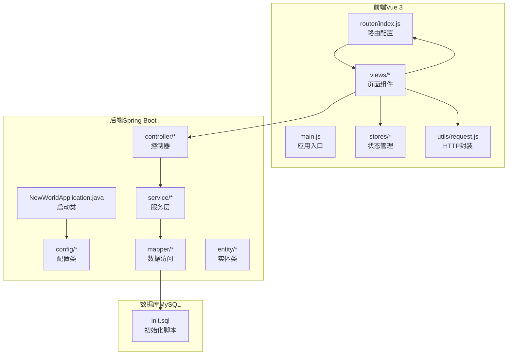
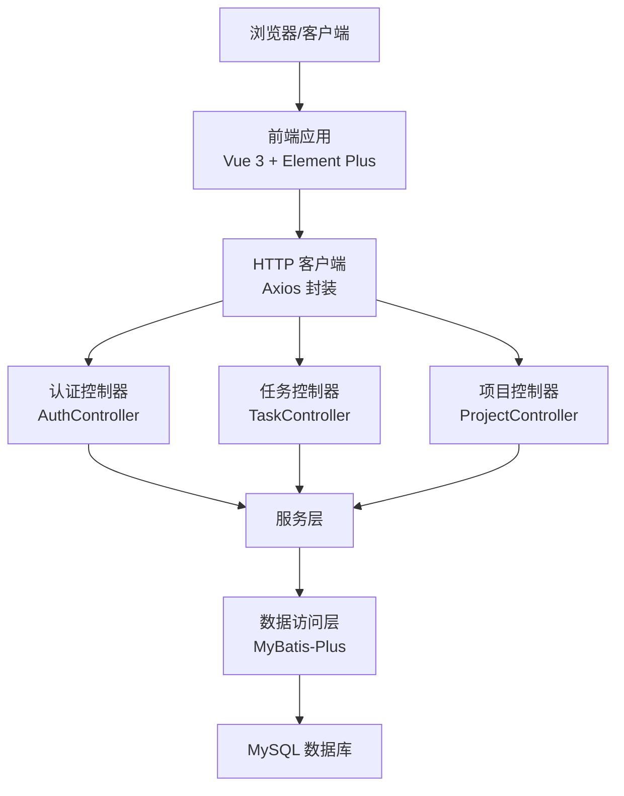
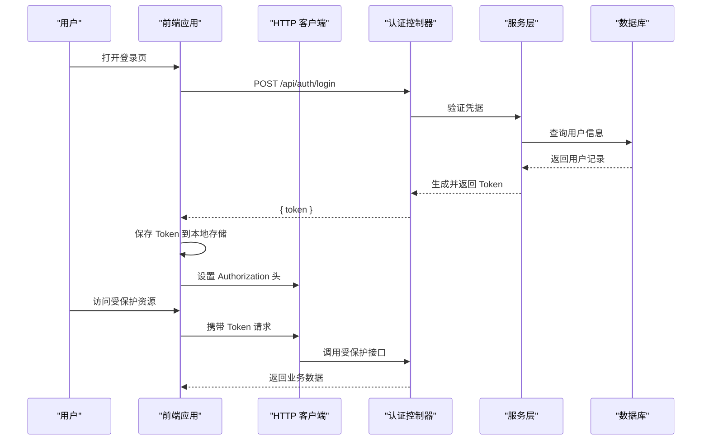
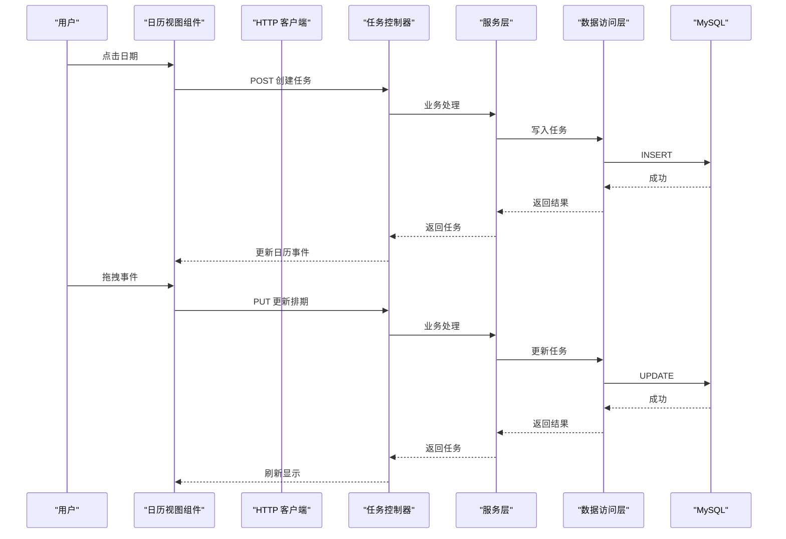
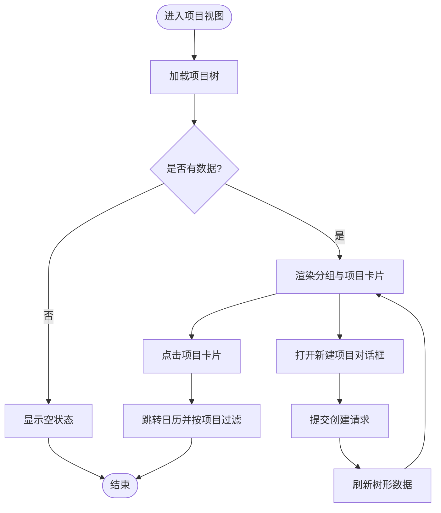
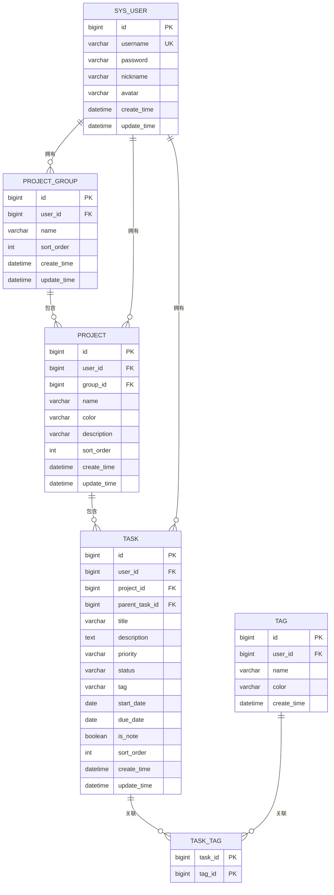
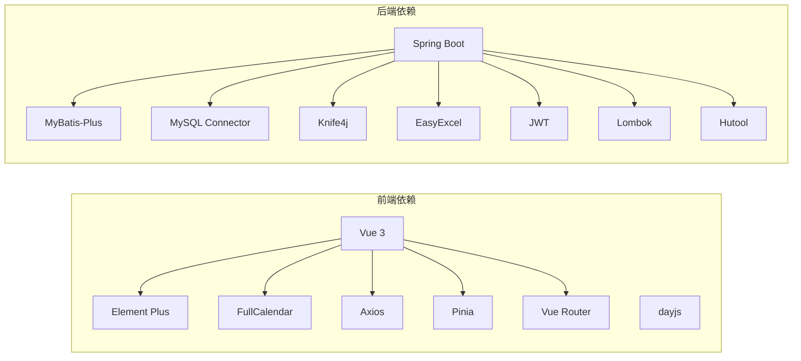

# 项目概述

<cite>
**本文引用的文件**
- [NewWorldApplication.java](file://backend/src/main/java/com/newworld/NewWorldApplication.java)
- [pom.xml](file://backend/pom.xml)
- [main.js](file://frontend/src/main.js)
- [package.json](file://frontend/package.json)
- [init.sql](file://backend/sql/init.sql)
- [AuthController.java](file://backend/src/main/java/com/newworld/controller/AuthController.java)
- [TaskController.java](file://backend/src/main/java/com/newworld/controller/TaskController.java)
- [ProjectController.java](file://backend/src/main/java/com/newworld/controller/ProjectController.java)
- [Task.java](file://backend/src/main/java/com/newworld/entity/Task.java)
- [User.java](file://backend/src/main/java/com/newworld/entity/User.java)
- [CalendarView.vue](file://frontend/src/views/CalendarView.vue)
- [ProjectView.vue](file://frontend/src/views/ProjectView.vue)
- [index.js](file://frontend/src/router/index.js)
- [auth.js](file://frontend/src/stores/auth.js)
- [request.js](file://frontend/src/utils/request.js)
</cite>

## 目录
1. [简介](#简介)
2. [项目结构](#项目结构)
3. [核心组件](#核心组件)
4. [架构总览](#架构总览)
5. [详细组件分析](#详细组件分析)
6. [依赖分析](#依赖分析)
7. [性能考虑](#性能考虑)
8. [故障排查指南](#故障排查指南)
9. [结论](#结论)
10. [附录](#附录)

## 简介
新世界（New World）个人工作计划管理系统是一个前后端分离的全栈应用，采用 Vue 3 + Spring Boot 技术栈构建，专注于个人任务管理与日程安排。系统通过清晰的模块划分与现代化的 UI 组件库，提供从任务创建、排期到日历视图展示与数据导出的完整工作流，帮助用户高效组织日常事务。

## 项目结构
项目采用典型的前后端分离架构：
- 前端：基于 Vue 3 + Vite，使用 Element Plus 作为 UI 组件库，配合 Pinia 进行状态管理，路由采用 Vue Router。
- 后端：基于 Spring Boot，使用 MyBatis-Plus 进行数据库访问，Knife4j 提供 OpenAPI 文档，JWT 实现鉴权，MySQL 作为持久化存储。
- 数据层：包含用户、项目分组、项目、任务、标签等核心实体，并建立必要的索引以优化查询性能。

**图表来源**
- [main.js:1-22](file://frontend/src/main.js#L1-L22)
- [index.js:1-50](file://frontend/src/router/index.js#L1-L50)
- [auth.js:1-41](file://frontend/src/stores/auth.js#L1-L41)
- [request.js:1-56](file://frontend/src/utils/request.js#L1-L56)
- [NewWorldApplication.java:1-13](file://backend/src/main/java/com/newworld/NewWorldApplication.java#L1-L13)
- [AuthController.java:1-55](file://backend/src/main/java/com/newworld/controller/AuthController.java#L1-L55)
- [TaskController.java:1-112](file://backend/src/main/java/com/newworld/controller/TaskController.java#L1-L112)
- [ProjectController.java:1-51](file://backend/src/main/java/com/newworld/controller/ProjectController.java#L1-L51)
- [init.sql:1-95](file://backend/sql/init.sql#L1-L95)

**章节来源**
- [main.js:1-22](file://frontend/src/main.js#L1-L22)
- [index.js:1-50](file://frontend/src/router/index.js#L1-L50)
- [auth.js:1-41](file://frontend/src/stores/auth.js#L1-L41)
- [request.js:1-56](file://frontend/src/utils/request.js#L1-L56)
- [NewWorldApplication.java:1-13](file://backend/src/main/java/com/newworld/NewWorldApplication.java#L1-L13)
- [pom.xml:1-117](file://backend/pom.xml#L1-L117)
- [package.json:1-30](file://frontend/package.json#L1-L30)
- [init.sql:1-95](file://backend/sql/init.sql#L1-L95)

## 核心组件
- 用户认证模块：提供登录、注册、获取当前用户信息等能力，基于 JWT 鉴权，统一在请求拦截器中注入 Authorization 头。
- 任务管理模块：支持任务的增删改查、状态变更、优先级调整、复制、归档、转换为笔记、分享链接生成以及统计与搜索。
- 项目管理模块：支持项目分组与项目树形结构的维护，提供按分组查询项目列表的能力。
- 日历视图模块：基于 FullCalendar 的交互式日历，支持拖拽排期、事件调整、右键菜单操作、弹窗编辑等。
- 数据导出模块：通过后端导出接口实现数据导出能力（具体实现位于导出控制器中）。
- 前端状态与路由：使用 Pinia 管理登录态与用户信息，Vue Router 控制页面跳转与鉴权守卫。

**章节来源**
- [AuthController.java:1-55](file://backend/src/main/java/com/newworld/controller/AuthController.java#L1-L55)
- [TaskController.java:1-112](file://backend/src/main/java/com/newworld/controller/TaskController.java#L1-L112)
- [ProjectController.java:1-51](file://backend/src/main/java/com/newworld/controller/ProjectController.java#L1-L51)
- [CalendarView.vue:1-451](file://frontend/src/views/CalendarView.vue#L1-L451)
- [ProjectView.vue:1-130](file://frontend/src/views/ProjectView.vue#L1-L130)
- [auth.js:1-41](file://frontend/src/stores/auth.js#L1-L41)
- [request.js:1-56](file://frontend/src/utils/request.js#L1-L56)

## 架构总览
系统采用前后端分离设计，前端负责用户界面与交互，后端提供 REST 接口与业务逻辑，数据库承载持久化数据。请求通过 Axios 发起，后端通过 Spring MVC 暴露接口，服务层调用数据访问层，最终映射到 MySQL 表结构。

**图表来源**
- [main.js:1-22](file://frontend/src/main.js#L1-L22)
- [request.js:1-56](file://frontend/src/utils/request.js#L1-L56)
- [AuthController.java:1-55](file://backend/src/main/java/com/newworld/controller/AuthController.java#L1-L55)
- [TaskController.java:1-112](file://backend/src/main/java/com/newworld/controller/TaskController.java#L1-L112)
- [ProjectController.java:1-51](file://backend/src/main/java/com/newworld/controller/ProjectController.java#L1-L51)
- [init.sql:1-95](file://backend/sql/init.sql#L1-L95)

## 详细组件分析

### 认证与会话流程
用户通过登录接口提交凭据，后端验证后返回 JWT Token；前端将 Token 存储于本地并写入请求头，后续接口调用均携带该头。登出时清除本地 Token 并重定向至登录页。

**图表来源**
- [AuthController.java:25-32](file://backend/src/main/java/com/newworld/controller/AuthController.java#L25-L32)
- [auth.js:16-21](file://frontend/src/stores/auth.js#L16-L21)
- [request.js:9-19](file://frontend/src/utils/request.js#L9-L19)

**章节来源**
- [AuthController.java:1-55](file://backend/src/main/java/com/newworld/controller/AuthController.java#L1-L55)
- [auth.js:1-41](file://frontend/src/stores/auth.js#L1-L41)
- [request.js:1-56](file://frontend/src/utils/request.js#L1-L56)

### 任务管理与日历交互
日历视图通过 FullCalendar 展示任务事件，支持点击日期创建任务、拖拽调整开始/结束日期、右键菜单执行状态与优先级变更、复制、归档、转换为笔记等操作。所有操作均通过 API 调用后端控制器完成。

**图表来源**
- [CalendarView.vue:250-292](file://frontend/src/views/CalendarView.vue#L250-L292)
- [TaskController.java:39-52](file://backend/src/main/java/com/newworld/controller/TaskController.java#L39-L52)
- [Task.java:1-184](file://backend/src/main/java/com/newworld/entity/Task.java#L1-L184)

**章节来源**
- [CalendarView.vue:1-451](file://frontend/src/views/CalendarView.vue#L1-L451)
- [TaskController.java:1-112](file://backend/src/main/java/com/newworld/controller/TaskController.java#L1-L112)
- [Task.java:1-184](file://backend/src/main/java/com/newworld/entity/Task.java#L1-L184)

### 项目管理与树形结构
项目视图展示项目分组与项目卡片，支持新建项目并自动刷新树形数据。项目与任务之间存在一对多关系，便于按项目维度筛选与查看任务统计。

**图表来源**
- [ProjectView.vue:10-38](file://frontend/src/views/ProjectView.vue#L10-L38)
- [ProjectController.java:22-27](file://backend/src/main/java/com/newworld/controller/ProjectController.java#L22-L27)

**章节来源**
- [ProjectView.vue:1-130](file://frontend/src/views/ProjectView.vue#L1-L130)
- [ProjectController.java:1-51](file://backend/src/main/java/com/newworld/controller/ProjectController.java#L1-L51)

### 数据模型与关系
系统核心实体围绕“用户—项目—任务—标签”展开，通过外键约束保证数据一致性，并在任务表上建立复合索引以提升查询效率。

**图表来源**
- [init.sql:8-95](file://backend/sql/init.sql#L8-L95)
- [Task.java:12-62](file://backend/src/main/java/com/newworld/entity/Task.java#L12-L62)
- [User.java:11-37](file://backend/src/main/java/com/newworld/entity/User.java#L11-L37)

**章节来源**
- [init.sql:1-95](file://backend/sql/init.sql#L1-L95)
- [Task.java:1-184](file://backend/src/main/java/com/newworld/entity/Task.java#L1-L184)
- [User.java:1-95](file://backend/src/main/java/com/newworld/entity/User.java#L1-L95)

## 依赖分析
- 前端依赖：Vue 3、Element Plus、FullCalendar、Axios、dayjs、Pinia、Vue Router。
- 后端依赖：Spring Boot、MyBatis-Plus、MySQL Connector、Knife4j、EasyExcel、JWT、Lombok、Hutool。

**图表来源**
- [package.json:11-24](file://frontend/package.json#L11-L24)
- [pom.xml:31-96](file://backend/pom.xml#L31-L96)

**章节来源**
- [package.json:1-30](file://frontend/package.json#L1-L30)
- [pom.xml:1-117](file://backend/pom.xml#L1-L117)

## 性能考虑
- 数据库层面：在任务表上建立复合索引以加速按用户、开始/截止日期与状态的查询；合理使用外键约束保证数据一致性。
- 前端层面：通过懒加载组件与按需引入插件减少首屏体积；在日历组件中仅渲染非归档且非笔记的任务事件，降低 DOM 渲染压力。
- 后端层面：使用 MyBatis-Plus 减少重复 SQL 编写；通过统一响应包装与异常处理提升稳定性；JWT 鉴权避免频繁会话开销。

## 故障排查指南
- 登录态失效：若出现 401 错误，前端会在响应拦截器中清除本地 Token 并跳转登录页。请确认 Token 是否正确注入 Authorization 头。
- 权限不足：403 错误通常表示未授权访问，检查用户权限与接口鉴权配置。
- 服务器错误：500 错误表示后端异常，查看后端日志定位具体异常点。
- 网络问题：网络异常时前端会提示网络错误，请检查代理与跨域配置。

**章节来源**
- [request.js:21-53](file://frontend/src/utils/request.js#L21-L53)

## 结论
新世界个人工作计划管理系统通过现代化的技术栈与清晰的模块划分，实现了从任务创建、日程排期到项目管理与数据导出的完整闭环。前后端分离的设计提升了开发效率与可维护性，结合良好的数据模型与索引策略，能够满足个人用户的日常任务管理需求。

## 附录
- 初始化脚本：包含数据库初始化、表结构定义与默认管理员账户创建。
- 启动类：后端应用入口，负责启动 Spring Boot 应用上下文。
- 前端入口：应用初始化、全局组件注册与国际化配置。

**章节来源**
- [init.sql:1-95](file://backend/sql/init.sql#L1-L95)
- [NewWorldApplication.java:1-13](file://backend/src/main/java/com/newworld/NewWorldApplication.java#L1-L13)
- [main.js:1-22](file://frontend/src/main.js#L1-L22)